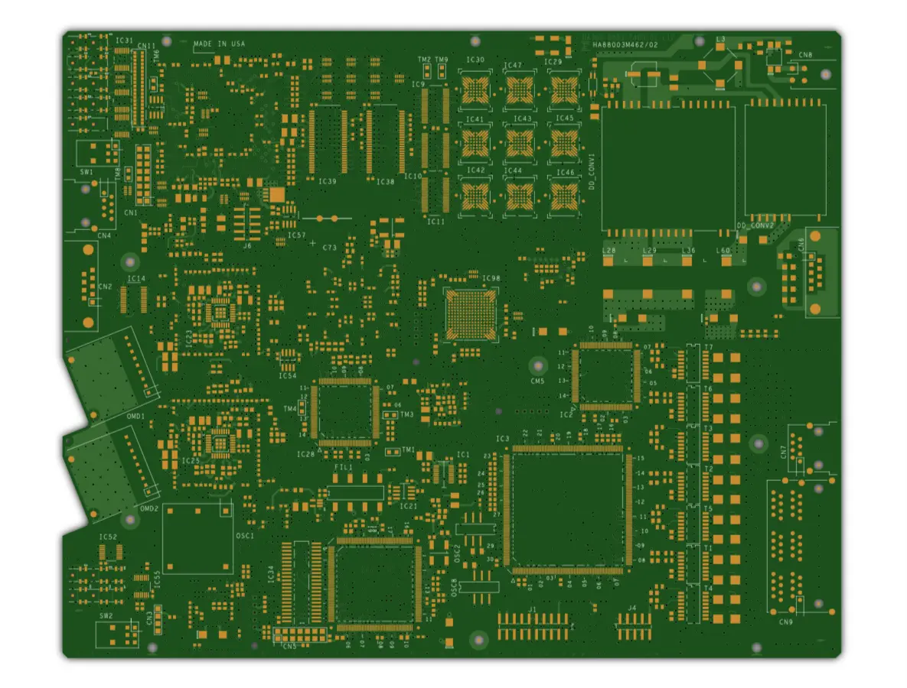

<a name="readme-top"></a>

<!-- PROJECT SHIELDS -->
<!--
*** I'm using markdown "reference style" links for readability.
*** Reference links are enclosed in brackets [ ] instead of parentheses ( ).
*** See the bottom of this document for the declaration of the reference variables
*** for contributors-url, forks-url, etc. This is an optional, concise syntax you may use.
*** https://www.markdownguide.org/basic-syntax/#reference-style-links
-->
<!--
[![Contributors][contributors-shield]][contributors-url]
[![Forks][forks-shield]][forks-url]
[![Stargazers][stars-shield]][stars-url]
[![Issues][issues-shield]][issues-url]
[![MIT License][license-shield]][license-url]
-->

<!-- PROJECT LOGO -->
<br />
<div align="center">
  <a href="https://github.com/midub/boardui">
    
  </a>

  <h3 align="center">BoardUI</h3>

  <p align="center">
    A PCB web viewer component for IPC-2581 format.
    <br />
    <a href="https://demo.boardui.com">View Demo</a>
    ·
    <a href="https://github.com/midub/boardui/issues">Report Bug</a>
    ·
    <a href="https://github.com/midub/boardui/issues">Request Feature</a>
  </p>
</div>

<!-- TABLE OF CONTENTS -->
<!--
<details>
  <summary>Table of Contents</summary>
  <ol>
    <li>
      <a href="#about-the-project">About The Project</a>
      <ul>
        <li><a href="#built-with">Built With</a></li>
      </ul>
    </li>
    <li>
      <a href="#getting-started">Getting Started</a>
      <ul>
        <li><a href="#prerequisites">Prerequisites</a></li>
        <li><a href="#installation">Installation</a></li>
      </ul>
    </li>
    <li><a href="#usage">Usage</a></li>
    <li><a href="#roadmap">Roadmap</a></li>
    <li><a href="#contributing">Contributing</a></li>
    <li><a href="#license">License</a></li>
    <li><a href="#contact">Contact</a></li>
    <li><a href="#acknowledgments">Acknowledgments</a></li>
  </ol>
</details>
-->


<!-- ABOUT THE PROJECT -->
## About BoardUI

<div align="left">
    
</div>

BoardUI is a set of libraries for visualization of printed circuit boards in format IPC-2581 in browser.

The project consists of 5 packages:
- boardui-parser - Parser for IPC-2581 and data model classes.
- boardui-renderer - Renderer of IPC-2581 to SVG.
- boardui-angular - Angular component to easily integrate parser and renderer with regular controls into Angular app.
- boardui-core - Shared lib
- boardui-demo - Demo angular app - also available at [demo.boardui.com](https://demo.boardui.com/)

### Built With

This section should list any major frameworks/libraries used to bootstrap your project. Leave any add-ons/plugins for the acknowledgements section. Here are a few examples.

* [![Angular][Angular.io]][Angular-url]
* [![TypeScript][typescriptlang]][TypeScript-url]


<!-- GETTING STARTED -->
<!--
## Getting Started

This is an example of how you may give instructions on setting up your project locally.
To get a local copy up and running follow these simple example steps.

### Prerequisites

This is an example of how to list things you need to use the software and how to install them.
* npm
  ```sh
  npm install npm@latest -g
  ```

### Installation

_Below is an example of how you can instruct your audience on installing and setting up your app. This template doesn't rely on any external dependencies or services._

1. Get a free API Key at [https://example.com](https://example.com)
2. Clone the repo
   ```sh
   git clone https://github.com/your_username_/Project-Name.git
   ```
3. Install NPM packages
   ```sh
   npm install
   ```
4. Enter your API in `config.js`
   ```js
   const API_KEY = 'ENTER YOUR API';
   ```
-->

<!-- USAGE EXAMPLES -->
<!--
## Usage

Use this space to show useful examples of how a project can be used. Additional screenshots, code examples and demos work well in this space. You may also link to more resources.

_For more examples, please refer to the [Documentation](https://example.com)_
-->

<!-- ROADMAP -->
## Roadmap

See the [open issues](https://github.com/othneildrew/Best-README-Template/issues) for a full list of proposed features (and known issues).

<!-- CONTRIBUTING -->
## Contributing

Contributions are what make the open source community such an amazing place to learn, inspire, and create. Any contributions you make are **greatly appreciated**.

If you have a suggestion that would make this better, please fork the repo and create a pull request. You can also simply open an issue with the tag "enhancement".
Don't forget to give the project a star! Thanks again!

1. Fork the Project
2. Create your Feature Branch (`git checkout -b feature/AmazingFeature`)
3. Commit your Changes (`git commit -m 'Add some AmazingFeature'`)
4. Push to the Branch (`git push origin feature/AmazingFeature`)
5. Open a Pull Request

<!-- LICENSE -->
## License

Distributed under the MIT License. See `LICENSE` for more information.

<!-- CONTACT -->
## Contact

Michal Dub
<br />
[![LinkedIn][linkedin-shield]][linkedin-url]

<br />

This was built for my bachelor thesis in 2023.

<!-- ACKNOWLEDGMENTS -->
## Acknowledgments
* [IPC Consortium](https://www.ipc2581.com/)


<!-- MARKDOWN LINKS & IMAGES -->
<!-- https://www.markdownguide.org/basic-syntax/#reference-style-links -->
[contributors-shield]: https://img.shields.io/github/contributors/midub/boardui.svg?style=for-the-badge
[contributors-url]: https://github.com/midub/boardui/graphs/contributors
[forks-shield]: https://img.shields.io/github/forks/midub/boardui.svg?style=for-the-badge
[forks-url]: https://github.com/midub/boardui/network/members
[stars-shield]: https://img.shields.io/github/stars/midub/boardui.svg?style=for-the-badge
[stars-url]: https://github.com/midub/boardui/stargazers
[issues-shield]: https://img.shields.io/github/issues/midub/boardui.svg?style=for-the-badge
[issues-url]: https://github.com/midub/boardui/issues
[license-shield]: https://img.shields.io/github/license/midub/boardui.svg?style=for-the-badge
[license-url]: https://github.com/midub/boardui/blob/master/LICENSE
[linkedin-shield]: https://img.shields.io/badge/-LinkedIn-black.svg?style=for-the-badge&logo=linkedin&colorB=555
[linkedin-url]: https://linkedin.com/in/michaldub
[Angular.io]: https://img.shields.io/badge/Angular-DD0031?style=for-the-badge&logo=angular&logoColor=white
[Angular-url]: https://angular.io/
[typescriptlang]: https://img.shields.io/badge/Typescript-3178c6?style=for-the-badge&logo=typescript&logoColor=white
[TypeScript-url]: https://www.typescriptlang.org/
