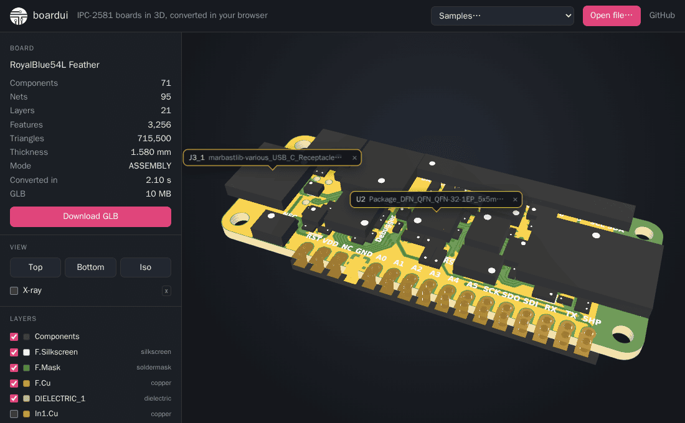
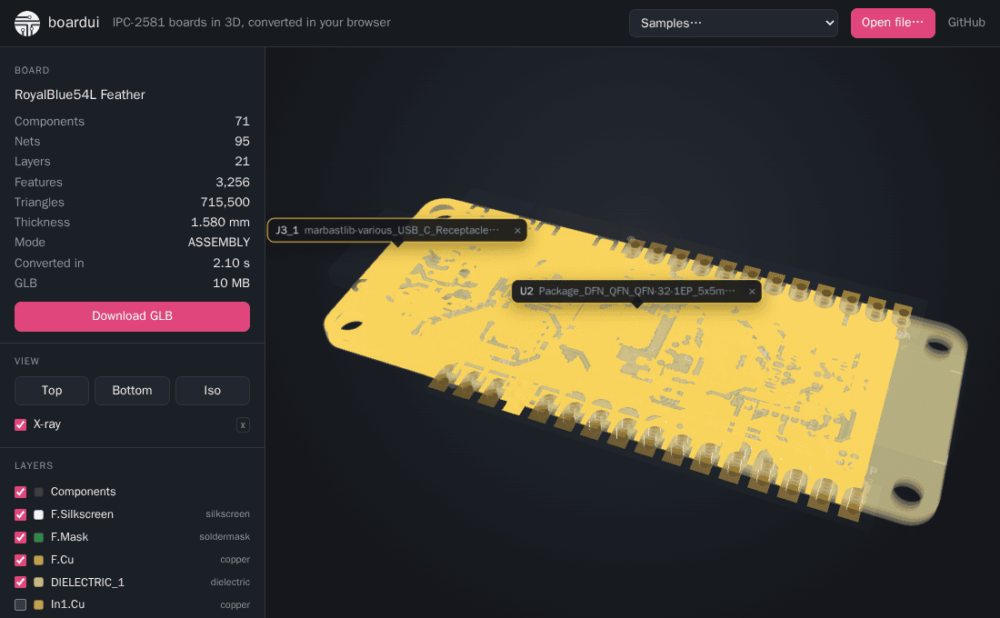

<div align="center">
  
  <h3>BoardUI</h3>
  <p>Printed circuit boards in 3D, in the browser: IPC-2581 in, glTF out, and an interactive viewer.</p>
  <p>
    <a href="https://midub.github.io/boardui/"><strong>Demo</strong></a> ·
    <a href="https://github.com/midub/boardui/releases/latest">Download the CLI</a> ·
    <a href="spec/README.md">Profile spec</a> ·
    <a href="CHANGELOG.md">Changelog</a>
  </p>
</div>

boardui turns an [IPC-2581](https://www.ipc2581.com) file into a glTF board and shows it in 3D. The board is a standard glTF 2.0 file that any glTF viewer can open, and it carries metadata for every component, pin, net, pad and trace, so a viewer can highlight elements and attach widgets to them.



- **Converter (Rust).** IPC-2581 in, GLB out. Copper, soldermask, silkscreen, dielectric, drills, barrels and slots are extruded from 2D regions; components get placeholder bodies or your own glTF models. It runs as a command-line tool and as WebAssembly in the browser, so boards never have to be uploaded anywhere.
- **Viewer (TypeScript + three.js).** `<board-viewer>`, a framework-independent web component: orbit, top/bottom/iso views, layer toggles, x-ray, hover and selection, net highlighting, and HTML widgets anchored to board elements.
- **[Demo](https://midub.github.io/boardui/)**, in [React](https://midub.github.io/boardui/react/) and [Angular](https://midub.github.io/boardui/angular/). Drop an IPC-2581 file, view it, download the GLB. The conversion runs in your browser.

The original Angular/SVG viewer (2023 bachelor thesis) lives at the [`v1-angular`](https://github.com/midub/boardui/tree/v1-angular) tag and branch.

## Command-line tool

### Install

Prebuilt binaries are attached to every [release](https://github.com/midub/boardui/releases/latest):

| Platform | Archive |
|---|---|
| Linux x86_64 (static) | `boardui-<version>-x86_64-unknown-linux-musl.tar.gz` |
| Linux ARM64 (static) | `boardui-<version>-aarch64-unknown-linux-musl.tar.gz` |
| macOS Apple silicon | `boardui-<version>-aarch64-apple-darwin.tar.gz` |
| macOS Intel | `boardui-<version>-x86_64-apple-darwin.tar.gz` |
| Windows x86_64 | `boardui-<version>-x86_64-pc-windows-msvc.zip` |

Each archive holds the `boardui` binary, `LICENSE` and this README; `SHA256SUMS` lists their checksums. For example, on Linux:

```sh
v=1.1.1 t=x86_64-unknown-linux-musl
curl -LO https://github.com/midub/boardui/releases/download/v$v/boardui-$v-$t.tar.gz
curl -LO https://github.com/midub/boardui/releases/download/v$v/SHA256SUMS
sha256sum --check --ignore-missing SHA256SUMS
tar -xzf boardui-$v-$t.tar.gz
sudo install boardui-$v-$t/boardui /usr/local/bin/
boardui --version
```

The macOS binaries are not signed: if macOS blocks one that was downloaded with a browser, run `xattr -d com.apple.quarantine boardui`. To build the CLI from source instead: `cargo install --locked --path crates/boardui` (see [Building from source](#building-from-source)).

### Usage

```sh
boardui convert board.xml -o board.glb                       # IPC-2581 in, boardui GLB out
boardui convert board.xml -o board.glb --models models.json  # your glTF models for component bodies
boardui validate board.glb                                   # check a GLB against the profile
```

- `convert` options: `--models <file>` maps packages or parts to glTF models ([schema](spec/schema/models.schema.json), spec §6.9), `--step <name>` picks a step of a multi-step file, `--tolerance <mm>` sets the maximum chord deviation of arcs, `--plating <mm>` the barrel wall thickness, `--validate` checks the output after writing it, and `--all-warnings` prints every warning instead of the first 20.
- `validate` checks the profile rules (spec §10). It also runs the [Khronos glTF validator](https://github.com/KhronosGroup/glTF-Validator) when `gltf_validator` is on `PATH` (`--no-khronos` skips it). It exits with status 1 if the file is invalid.
- `-v` prints the time of each pipeline step, `-vv` debug details, `-q` only errors. `boardui help <command>` lists everything.

The GLB opens in any glTF viewer. The samples in [`spec/samples`](spec/samples/README.md) double as the conformance suite.

## Embedding the viewer

`<board-viewer>` ([`packages/viewer`](packages/viewer/README.md)) shows a boardui GLB, and with `loadIpc2581` it converts IPC-2581 in a Web Worker first ([`packages/converter`](packages/converter/README.md)):

```html
<board-viewer src="board.glb" style="height: 600px"></board-viewer>
<script type="module">
  import '@boardui/viewer';

  const viewer = document.querySelector('board-viewer');
  viewer.addEventListener('bui-select', (e) => console.log(e.detail)); // { id, kind, properties } | null
  // await viewer.loadIpc2581(file);    // convert an IPC-2581 File locally, then show it
  // viewer.highlight({ net: 'net/GND' }, { color: '#ffcc00' });
</script>
```

In React, [`@boardui/react`](packages/react/README.md) wraps the element: props for its settings, typed event handlers, `ref` to the element for its methods, and `<Widget>` to render React children as widgets that follow board elements:

```tsx
import { BoardViewer, type BoardViewerElement } from '@boardui/react';

const viewer = useRef<BoardViewerElement>(null);
<BoardViewer ref={viewer} src="board.glb" style={{ height: 600 }} onSelect={(e) => console.log(e.detail)} />;
// await viewer.current.loadIpc2581(file);
```

In Angular, [`@boardui/angular`](packages/angular/README.md) does the same with a standalone component: signal inputs for the settings, typed outputs for the events, `element` for the methods, and `<bui-widget>` for Angular content in widgets:

```ts
import { BoardViewer, type ElementInfo } from '@boardui/angular';

@Component({
  imports: [BoardViewer],
  template: `<bui-board-viewer src="board.glb" style="height: 600px" (select)="selected.set($event)" />`,
})
export class Board {
  readonly selected = signal<ElementInfo | null>(null);
  readonly viewer = viewChild.required(BoardViewer);
  // await this.viewer().element.loadIpc2581(file);
}
```

v1 publishes nothing to npm, so build the packages from this repository and install them as tarballs:

```sh
git clone https://github.com/midub/boardui && cd boardui
pnpm install && pnpm build          # needs Rust and wasm-bindgen-cli, see below
pnpm --filter @boardui/converter --filter @boardui/viewer pack --pack-destination ../boardui-packages

cd ../my-app
npm install three ../boardui-packages/boardui-converter-1.1.1.tgz ../boardui-packages/boardui-viewer-1.1.1.tgz
```

For React, also pack `@boardui/react` (`--filter @boardui/react`) and install its tarball; for Angular, `@boardui/angular`; for runtime 3D models (KiCad's libraries, your own model server, STEP and OBJ), `@boardui/models` ([how](packages/models/README.md)).

`three` (`^0.186`) is a peer dependency. The packages are ES modules for a bundler such as Vite; the converter's WebAssembly module and worker are referenced with `new URL(…, import.meta.url)`, which Vite and other modern bundlers pick up. The Angular CLI's application builder doesn't, so an Angular app copies them next to its scripts ([how](packages/angular/README.md#the-workers-and-wasm-with-the-angular-cli)). The demos, [`packages/demo-react`](packages/demo-react/README.md) and [`packages/demo-angular`](packages/demo-angular/README.md), are complete examples.

## Profile spec

How a board is represented in glTF, which metadata it carries and how element IDs work: [glTF profile spec](spec/README.md), with [JSON schemas](spec/schema/) and [sample boards](spec/samples/README.md). Design background: [architecture](docs/architecture.md), [roadmap](docs/roadmap.md), [decision records](docs/adr/README.md).

## Limits

- **Browser conversion:** the WebAssembly converter is 32-bit, so a conversion can use at most 4 GiB of memory. Boards up to about 250,000 features convert in the browser (a 238k-feature board needs 3.1 GB); larger ones need the CLI.
- **Not modelled** (profile 0.8): embedded components, cavities, rigid-flex. Panels (`StepRepeat`) convert with a full copy of every board they place. Unknown IPC-2581 elements are skipped with a warning.
- **Component bodies** are the package outline extruded to the component's height (estimated when the file has none), unless you map them to glTF models.
- **The viewer** needs WebGPU or WebGL2.



## Repository layout

| Path | Contents |
|---|---|
| `crates/boardui-ipc2581` | IPC-2581 reader |
| `crates/boardui-geom` | board geometry |
| `crates/boardui-gltf` | glTF profile writer |
| `crates/boardui-convert` | conversion pipeline and validation |
| `crates/boardui` | `boardui` command-line tool |
| `crates/boardui-wasm` | WebAssembly bindings |
| `packages/converter` | `@boardui/converter`: converter in a Web Worker |
| `packages/viewer` | `@boardui/viewer`: `<board-viewer>` |
| `packages/react` | `@boardui/react`: React wrapper of `<board-viewer>` |
| `packages/models` | `@boardui/models`: runtime model sources (KiCad's libraries, model mapping files) and STEP/OBJ loaders |
| `packages/angular` | `@boardui/angular`: Angular wrapper of `<board-viewer>` |
| `packages/demo-react` | demo app in React, deployed to GitHub Pages |
| `packages/demo-angular` | the same demo app in Angular, deployed to GitHub Pages |
| `packages/demo-shared` | the demos' framework-independent code, build helpers and e2e tests |
| `spec/` | profile spec, JSON schemas, sample boards |

## Building from source

Prerequisites: [rustup](https://rustup.rs) (the toolchain version is pinned in `rust-toolchain.toml` and installed automatically), Node.js 24 and pnpm (`corepack enable`). `pnpm build` also builds the WebAssembly converter, which needs [`wasm-bindgen-cli`](https://github.com/wasm-bindgen/wasm-bindgen) at the version of the `wasm-bindgen` crate in `Cargo.lock` (`cargo install wasm-bindgen-cli --version 0.2.129`) and, optionally, `wasm-opt` from [binaryen](https://github.com/WebAssembly/binaryen).

```sh
# Rust
cargo fmt --all --check
cargo clippy --workspace --all-targets -- -D warnings
cargo test --workspace
cargo build -p boardui-wasm --target wasm32-unknown-unknown --release
cargo build -p boardui --release                # → target/release/boardui

# Web
pnpm install
pnpm lint
pnpm build
pnpm test
pnpm site                                       # the Pages site in site/: the demos and the redirect
pnpm e2e                                        # Playwright tests of the demos (see packages/demo-shared)
```

The demos run locally as Pages serves them with `pnpm build && pnpm site && node packages/demo-shared/dist/build/cli.js serve site` at <http://127.0.0.1:4173/boardui/>, or one at a time with `pnpm --filter @boardui/demo-react preview` (after `pnpm build`) and `pnpm --filter @boardui/demo-angular dev`.

CI (`.github/workflows/ci.yml`) runs all of the above plus the conformance suite. Pushes to `master` deploy the demos to GitHub Pages (`pages.yml`: the React demo at `/boardui/react/`, the Angular demo at `/boardui/angular/`, and <https://midub.github.io/boardui/>, which redirects to the React demo), and `v*` tags build the release binaries (`release.yml`).

## License

[MIT](LICENSE), except the sample boards in `spec/samples` that say otherwise:

- [`kicad-royalblue54l-feather`](spec/samples/kicad-royalblue54l-feather/README.md): CERN-OHL-P v2, see its `LICENSE`.
- [`ipc-testcases`](spec/samples/ipc-testcases/README.md): the IPC-2581 Consortium's test cases are not in the repository, the demo or the release archives; the repository and the demo link to them on <https://www.ipc2581.com>. `python3 spec/samples/ipc-testcases/fetch.py` fetches them as test data.
